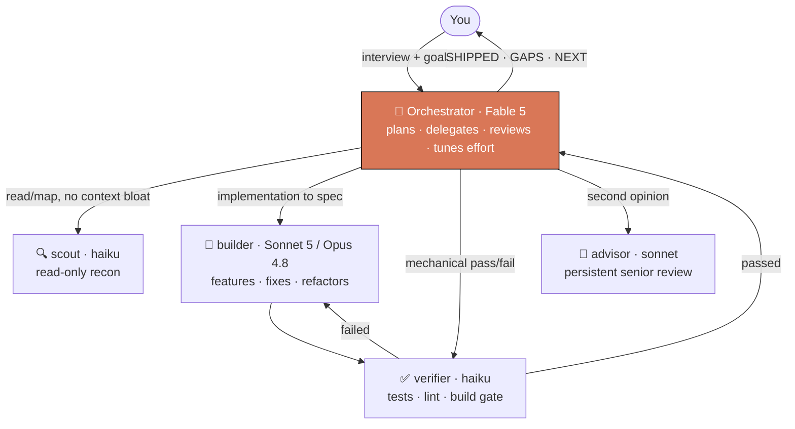
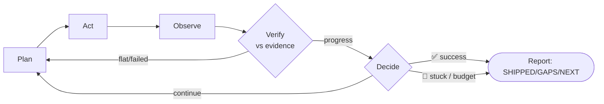

<div align="center">

# Flux Skills

**Turn Claude from a lone worker into an orchestrator with a team.**

[](LICENSE)
[](https://docs.claude.com/en/docs/claude-code/plugins)


Created by **Jacques**, founder of **[Adrective](https://github.com/adrective-oss)**.

</div>

> **Requires [Claude Code](https://docs.claude.com/en/docs/claude-code)** (CLI or IDE extension). These are Claude Code skills — they don't run in Claude chat or Cowork.

Two [Claude Code](https://docs.claude.com/en/docs/claude-code) skills that change *how* Claude works on big tasks — it plans, delegates to cheaper specialized subagents, and verifies their output against real evidence instead of grinding through everything itself.

| Skill | What it does |
|-------|--------------|
| **`flux-delegation`** | Puts the model into **architect/orchestrator mode**. It interviews you, designs a team of specialized subagents (builder, verifier, scout, advisor), routes each piece of work to the cheapest capable agent, and reviews. It spends its own expensive tokens only on decisions, synthesis, and review. |
| **`flux-loop`** | **Sustained autonomous execution** toward a checkable goal — the Ralph-loop pattern. Plan → Act → Observe → Verify → Decide, every cycle, verifying progress against real evidence. Built to defeat *"agentic laziness"* — the model quitting before the task is actually done. |

They compose: `flux-delegation` builds the team, `flux-loop` drives it toward a goal unattended.

## Why

The most expensive tokens in a session are the top model's. Every file it reads, scan it runs, or line of boilerplate it writes is a token stolen from the judgment work only it can do. Flux fixes the economics:

- **Route by cost, not prestige.** Haiku scans and runs checks. Sonnet implements. The top model decides. A cheap agent with an elite brief beats an expensive one with a vague one.
- **Verify in tiers.** Mechanical checks (tests/lint/build) run on a cheap verifier first; quality review only on what passes; the orchestrator reviews only architecture and synthesis. Nothing failing a lower tier reaches a higher one.
- **Trust evidence, not narration.** A subagent's "done" means nothing until it's checked against a tool result — test output, a diff, a log.

## flux-delegation — the team



The four subagent definitions ship in [`flux/skills/flux-delegation/agents/`](flux/skills/flux-delegation/agents). The team, routing decisions, and open items get written to `.claude/TEAM.md` in your project — so session 2 costs a fraction of session 1.

> **Recommended setup — Flux is built for [Fable 5](https://docs.claude.com/en/docs/about-claude/models) as the orchestrator.** Fable 5's strength is dispatching and directing subagents, which is exactly the orchestrator's job — run it there and Flux is at its best. The builder runs **Sonnet 5 or Opus 4.8** for real implementation; scout and verifier run Haiku for cheap recon and mechanical gating. You don't hand-tune any of this: **the orchestrator sets each agent's effort level automatically, per task**, dialing it up for hard judgment and down for mechanical work — so every step runs at the right cost without you managing it.

### How the delegation actually works

- **Solo vs. delegate, decided first.** It doesn't blindly spawn a team. Single-context, tightly-interdependent, or fast-to-one-shot work the orchestrator does itself; only parallelizable, mechanical, context-heavy, or long-horizon work gets delegated — routed per workstream, not per project.
- **Least-privilege tools.** Each agent gets only the tools its job needs. `scout` and `advisor` can't modify files; `verifier` runs checks but can't write; only `builder` writes and edits.
- **Every delegation carries a full brief.** Goal *and why*, file pointers (never pasted content the agent can read itself), a checkable definition of done including the quality bar, the exact report format, and hard constraints. A cheap agent with an elite brief beats an expensive one with a vague one.
- **Async and parallel by default.** Independent work dispatches simultaneously; the orchestrator keeps moving instead of blocking on one agent. Concurrent edits to the same repo run in separate git worktrees.
- **Agents compound across sessions.** `builder` and `advisor` carry persistent `memory` — they record lessons and corrections and read them before starting, so they measurably improve run over run. The team, routing history, and open items persist in `.claude/agents/` and `.claude/TEAM.md`, so session 2 skips the setup session 1 paid for.
- **Nothing is trusted until verified.** A subagent's "done" is checked against real tool output — test result, diff, log — before it counts. Only verified work appears under **SHIPPED**; unverified beliefs go under **GAPS**.

## flux-loop — the cycle



It won't start on a vague goal — it interviews for a **checkable finish line** ("all tests in `/tests` pass and lint is clean"), a hard iteration/budget ceiling, and a failure condition, before the first cycle. It commits after every meaningful unit so progress is recoverable and visible without narration.

## Install

**Recommended — as a plugin.** In Claude Code, add this marketplace and install the `flux` plugin (bundles both skills):

```
/plugin marketplace add adrective-oss/flux-skills
/plugin install flux@adrective
```

Both skills load immediately — no restart, and `/plugin update` keeps them current.

<details>
<summary><b>Alternative — manual copy</b> (no plugin system)</summary>

Skills live in `~/.claude/skills/`. Clone and copy:

```bash
git clone https://github.com/adrective-oss/flux-skills.git
cp -R flux-skills/flux/skills/flux-delegation flux-skills/flux/skills/flux-loop ~/.claude/skills/
```

Or run the installer (copies both, prompts before overwriting):

```bash
cd flux-skills && ./install.sh
```

Start a new Claude Code session and both skills are available.
</details>

## Use

**flux-delegation** — invoke at the start of a project or session when the work is big enough to warrant a team. Not for one-turn questions or single-file edits.

```
> Use flux-delegation. I'm building a REST API with auth, rate limiting, and a
  Postgres layer, production-grade.

Orchestrator: [interviews you on scope, quality bar, constraints]
              [designs a 4-agent team, writes .claude/TEAM.md]
              [delegates the Postgres layer to builder, schema audit to scout,
               runs the test gate on verifier, sanity-checks the design with advisor]

SHIPPED  ✓ auth middleware — 14/14 tests pass (verifier)
         ✓ rate limiter — diff at src/mw/rate.ts, load test 0 drops
GAPS     · Postgres pooling unverified — integration test still red
NEXT     1. Fix pool exhaustion under concurrent writes
```

**flux-loop** — invoke *after* flux-delegation has built the team, when you want long-horizon work that runs unattended toward a goal you can state as a finish line. It inherits the team and `TEAM.md`.

```
> Use flux-loop. Goal: every test in /tests green and lint clean. Max 20 cycles.
  Stop and report if the same test fails 3 times. Don't touch the migrations dir.
```

Both are model-agnostic — they route work across Fable/Opus/Sonnet/Haiku by task difficulty, not by which model is running them. They shine brightest with **Fable 5 driving** as the orchestrator.

## What's a skill?

A [Claude Code skill](https://docs.claude.com/en/docs/claude-code/skills) is a folder with a `SKILL.md` that Claude loads on demand when your task matches its description. No code to run — just expert instructions Claude follows. These two are pure instructions plus, for flux-delegation, four subagent definitions.

## Author

Built by **Jacques**, founder of **[Adrective](https://github.com/adrective-oss)**. If Flux saves you tokens, a ⭐ on the repo is the thanks that helps others find it.

## License

[MIT](LICENSE) — use, modify, redistribute freely.
